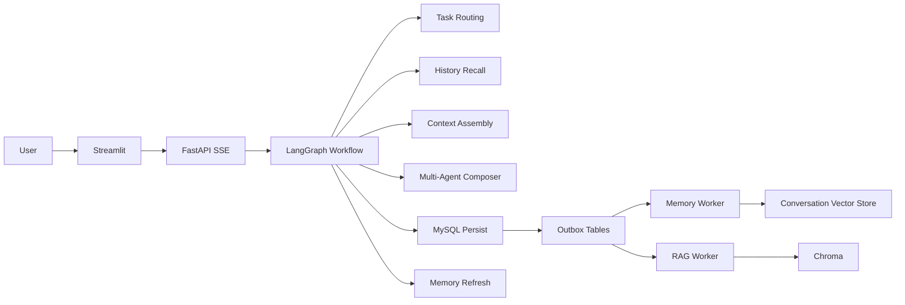

# 全屋家具智能管家

一个面向家具客服、导购、保养和售后场景的 Agent 项目，基于 `LangGraph + LangChain` 构建，集成了专家多 Agent 默认链路、可切换 Function Calling 工具链路、分层记忆、混合 RAG、MySQL Outbox、异步 Worker 和 Streamlit 前端。

当前目标不是做“能聊”的 Demo，而是做成可复现、可评测、可观测、可扩展的工程作品，适合用于投递 `Agent 开发` / `AI 应用工程师` 岗位。

## 现在有什么

- 专家多 Agent 编排：默认链路通过 `MultiAgentRouter` 选择 `KnowledgeAgent` 或 `ReportAgent`，由 `MultiAgentRunner` 执行，再由 `AnswerComposer` 合成最终答复；闲聊和非业务问题走默认回复，不会每次把所有专家都跑一遍。
- 可切换工具调用链路：`agentic_tools.py` 暴露知识库、用户报表和天气工具；当前 `ReactAgent` 默认 `use_agentic_mode=False`，也就是默认走专家多 Agent 分支。
- 分层记忆：短期窗口、会话摘要、用户长期记忆。
- RAG：MySQL 记录文档版本与分片，Chroma 负责召回，BGE Reranker 负责重排。
- 事务持久化：一轮对话的消息、任务和 outbox 统一走 MySQL。
- 异步 Worker：会话向量索引与知识索引独立重试，不阻塞主聊天链路。
- SSE 流式输出：前端仍以流式方式接收回答。

## 当前默认执行链路

`api.py` 的 `/chat` 接口创建 `session_id`、`user_uuid` 和 `request_id` 后，会调用 `ReactAgent`。`ReactAgent` 内部组装 `AgentGraphWorkflow(use_agentic_mode=False)`，默认执行顺序是：

1. `route_task` 和 `recall_history` 并行执行，分别处理任务路由和历史召回。
2. `assemble_context` 组装系统上下文、近期历史和长期记忆。
3. `route_specialists` 选择最多两个专家，目前主要是 `KnowledgeAgent` 和 `ReportAgent`。
4. `dispatch_specialists` 执行专家，知识类问题进入 RAG，报表类问题查询外部记录。
5. `compose_answer` 合成统一回复。
6. `persist_turn` 写入 MySQL，并发出记忆索引 outbox。
7. `update_task_state` 和 `refresh_user_memory` 更新任务状态与用户记忆。

`agentic_tools.py` 里的工具调用迭代链路仍保留在 `AgentGraphWorkflow` 中，可以通过切换 `use_agentic_mode=True` 使用；它思想上接近 Action/Observation，但不是当前默认入口。

## 架构



## 启动方式

先复制环境变量示例：

```bash
cp .env.example .env
```

### Docker Compose

启动容器环境：

```bash
make up
```

Docker Compose 会启动 MySQL、Redis、Chroma、API 和 Streamlit。容器内 API 端口是 `8000`，Streamlit 通过 `API_BASE=http://api:8000` 访问它。

如果要让后台索引持续消费 outbox，需要额外启动 Worker，或在 Compose 中补 worker 服务：

```bash
uv run python -m workers.memory_index_worker
uv run python -m workers.rag_index_worker
```

本地常用命令：

```bash
make test
make eval
make benchmark
make migrate
make clean
```

### 本地直跑

如果你更习惯直接跑 Python，需要先保证 MySQL、Redis 和 Chroma 可访问，然后执行：

```bash
uv sync --frozen
uv run alembic upgrade head
uv run python api.py
uv run streamlit run app.py
```

本地直跑时 `api.py` 默认监听 `8008`，`app.py` 默认用 `API_BASE=http://localhost:8008` 访问接口。

## 模型下载

仓库里不再提交大模型文件，下载脚本在：

```bash
python scripts/download_models.py
```

默认会把 reranker 下载到 `models/bge-reranker-base/`。

## 目录说明

- `api.py`：FastAPI SSE 接口
- `app.py`：Streamlit 前端
- `agent/`：Agent 编排、记忆、任务和上下文组装
- `rag/`：知识解析、切块、检索和索引 CLI
- `db/`：MySQL、Redis、Chroma 和业务仓储
- `workers/`：会话向量与知识索引 worker
- `evaluation/`：轻量评测入口
- `data/`：知识库源文件
- `alembic/`：数据库迁移

## 当前状态

这个版本已经把项目从“功能完整的 Demo”往“求职级生产化作品”推进了一步，后续还会继续补：

- JWT 登录与资源隔离
- 更完整的评测集和 CI
- 真流式 token 输出
- 可观测性与压测
- 售后工单闭环

## 许可

MIT
